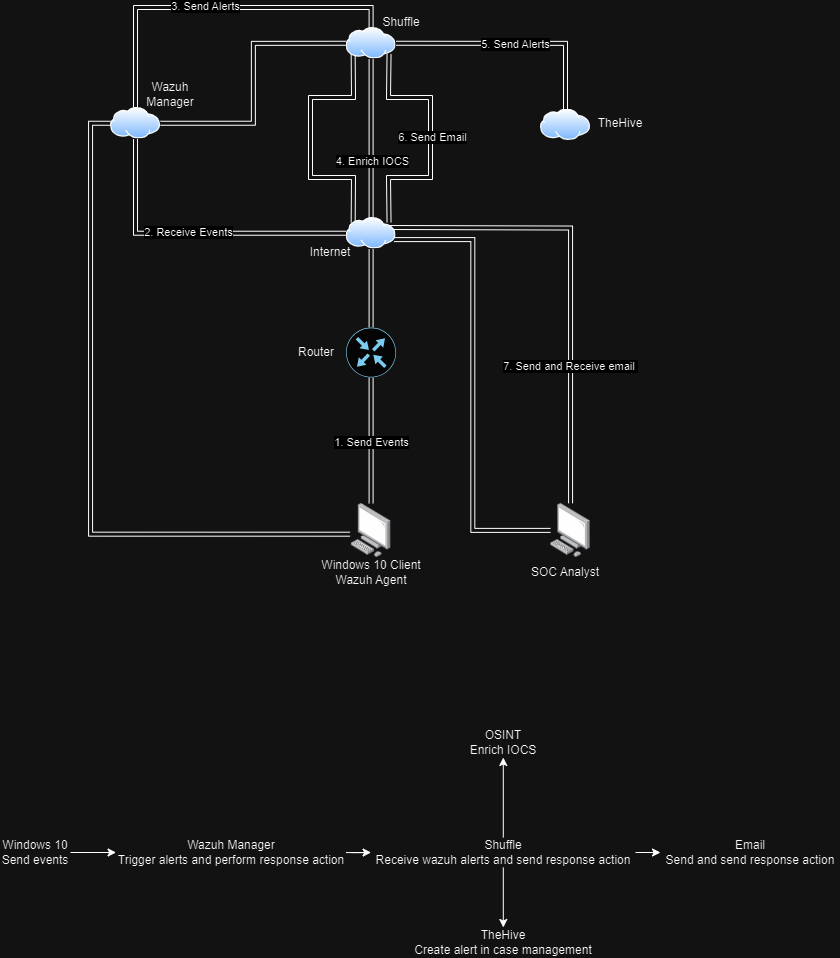

# Diagram-SOC-Automation

The SOC Automation Diagram shows the flow of security event detection and response, starting from the endpoint (Windows 10 Client) and going all the way to the Security Operations Center (SOC) Analyst. Below is a detailed breakdown of each component and its role in the process:

## Components and Workflow

### 1. Windows 10 Client (Wazuh Agent)
- **Windows 10 Client**: A regular computer running Windows 10, used by an organization.
- **Wazuh Agent**: A lightweight software installed on the client. It collects security-related data like log files, suspicious activities, and system changes, then forwards it for analysis.

### 2. Router
- **Router**: Forwards data between computer networks. It sends event data from the Wazuh Agent to the Wazuh Manager.

### 3. Internet
- **Internet**: Transfers event data from the local network to a remote server for further analysis.

### 4. Wazuh Manager
- **Wazuh Manager**: The main component of the Wazuh platform. It receives data from Wazuh Agents across the network and analyzes it for threats.
- **Receive Events**: Collects logs and security data from agents.
- **Send Alerts**: If suspicious activity is detected, it sends alerts to the **Shuffle** automation platform.

### 5. Shuffle (Automation Platform)
- **Shuffle**: An automation platform that handles alerts and helps streamline the response process.
  - **Enrich IOCs (Indicators of Compromise)**: Gathers context for the detected IOCs, determining the level of threat.
  - **Send Alerts**: Sends enriched alerts to **TheHive** for further incident management.
  - **Send Email**: Sends email notifications to keep the security team informed of ongoing incidents.

### 6. TheHive (Incident Response Platform)
- **TheHive**: An open-source incident response platform that helps manage incidents and enables collaboration for threat investigation. It organizes alerts into cases, allowing systematic investigation by SOC Analysts.

### 7. SOC Analyst
- **SOC Analyst**: Works in the Security Operations Center, responsible for monitoring alerts, analyzing threats, and coordinating incident response.
- **Send and Receive Emails**: Uses email to communicate and coordinate with other teams and stakeholders during the incident response process.

## Step-by-Step Flow

1. **Event Generation (Windows 10 Client)**
   - The Wazuh Agent continuously monitors the Windows 10 Client for log data and suspicious activities.
   - When an event is detected (e.g., unauthorized access attempts), the agent generates and forwards this event.

2. **Event Forwarding (Router)**
   - The router forwards event data from the Wazuh Agent to the Wazuh Manager over the network.

3. **Event Transfer (Internet)**
   - The router sends the event data through the internet to a central Wazuh Manager, especially useful when hosted remotely.

4. **Event Reception and Analysis (Wazuh Manager)**
   - The Wazuh Manager collects data from all agents and analyzes it for any threats or indicators of compromise.
   - If a potential threat is identified, it generates an alert and sends it to **Shuffle** for automated handling.

5. **Alert Handling and Automation (Shuffle)**
   - **Shuffle** enriches the alert with additional information to determine the severity of the threat.
   - Based on predefined rules, Shuffle can send emails, notify relevant personnel, or send alerts to **TheHive** for case management.

6. **Incident Management (TheHive)**
   - **TheHive** receives enriched alerts and organizes them into incidents for further investigation by SOC Analysts.
   - The platform provides a structured environment to document findings and track responses to incidents.

7. **Human Response (SOC Analyst)**
   - The SOC Analyst reviews all information, enriched data, and automated actions taken so far.
   - They decide on an appropriate response: mitigating the threat, notifying stakeholders, or escalating the incident.
   - The SOC Analyst communicates via email to coordinate incident response and ensure the organization is aware of the situation.

8. **Continuous Monitoring and Improvement**
   - The system continually monitors for new events and threats, with automated and manual processes working together to detect, analyze, and mitigate security incidents effectively.
